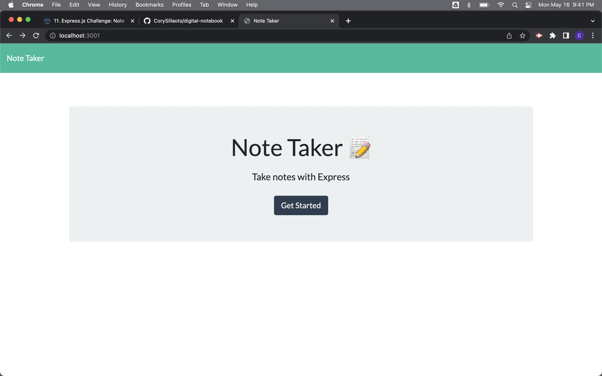
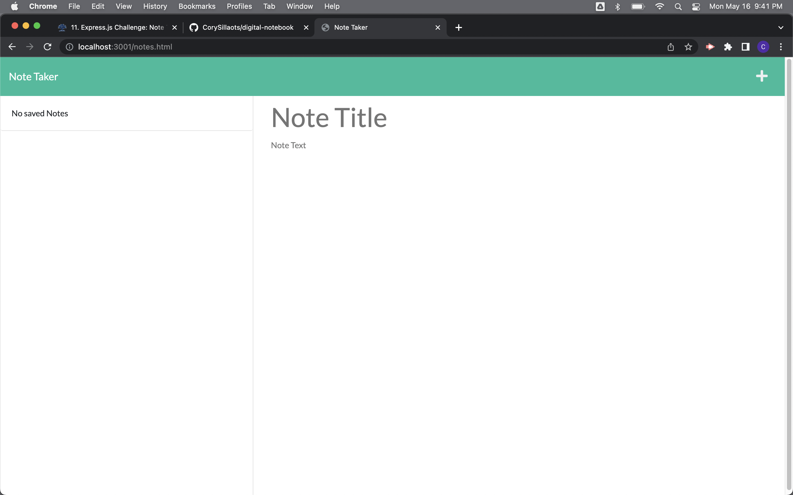
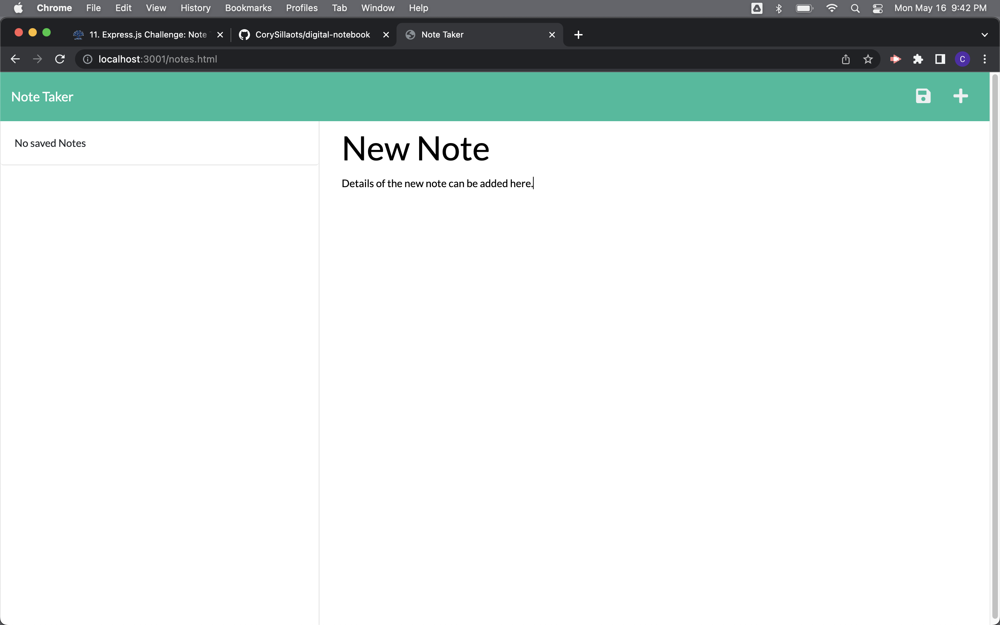
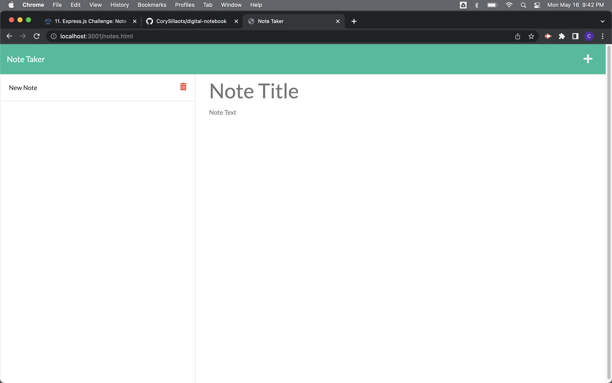

## Digital Notebook (Module 11 Challenge)

Active URL: [PasswordGenerator](https://github.com/CorySillaots/digital-notebook)
## Installation:
In order to access the files needed to complete the challenge see: https://github.com/CorySillaots/digital-notebook and clone either the following HTTPS link or SSH key:
HTTPS Link: https://github.com/CorySillaots/digital-notebook.git
SSH Key: git@github.com:CorySillaots/digital-notebook.git
In order to clone the project to a "projects" directory, open your terminal (mac) or gitbash (windows) window and type the following commands into your terminal/gitbash command line:
1 - mkdir projects
2 - cd ./projects (You can use the command "pwd" to ensure you are in the correct directory)
3 - git clone <HTTPS link> OR git clone <SSH Key>
4 - ls (this will list all of the files now inside of the current directory)

## Usage
- The purpose of the Digital Notebook is to allow a user to add, modify and delete notes.
- The Digital Notebook must start the user on a landing page with a "get started" button
- The user will then be met with two columns on the next page.
- The left column is a history of notes that have been made and will populate the "note creator" when clicked on.
- The right column is a note creator that allows the user to enter a Note title and description.
- The note creator will have an add ans save button that will allow the user to add a new note and save it to the left hand column.

##
An image of the mock up can be seen in the "Develop" folder in the main repository of the module 3 challenge titled "Generator Mock Up.png"

## Collaborators and References
- Module 11 Project Code
    University Of Toronto SCS Coding Boot Camp

- W3 Schools
    www.w3schools.com

- Stack Overflow
    https://stackoverflow.com

- Codecademy
    www.codecademy.com

## License
Copyright 2022, Cory Sillaots

Permission is hereby granted, free of charge, to any person obtaining a copy of this software and associated documentation files (the "Software"), to deal in the Software without restriction, including without limitation the rights to use, copy, modify, merge, publish, distribute, sublicense, and/or sell copies of the Software, and to permit persons to whom the Software is furnished to do so, subject to the following conditions:

The above copyright notice and this permission notice shall be included in all copies or substantial portions of the Software.

THE SOFTWARE IS PROVIDED "AS IS", WITHOUT WARRANTY OF ANY KIND, EXPRESS OR IMPLIED, INCLUDING BUT NOT LIMITED TO THE WARRANTIES OF MERCHANTABILITY, FITNESS FOR A PARTICULAR PURPOSE AND NONINFRINGEMENT. IN NO EVENT SHALL THE AUTHORS OR COPYRIGHT HOLDERS BE LIABLE FOR ANY CLAIM, DAMAGES OR OTHER LIABILITY, WHETHER IN AN ACTION OF CONTRACT, TORT OR OTHERWISE, ARISING FROM, OUT OF OR IN CONNECTION WITH THE SOFTWARE OR THE USE OR OTHER DEALINGS IN THE SOFTWARE.

